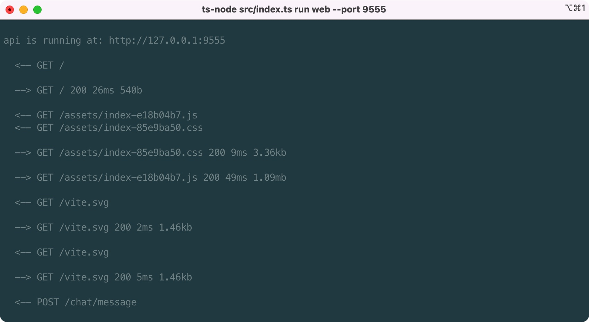
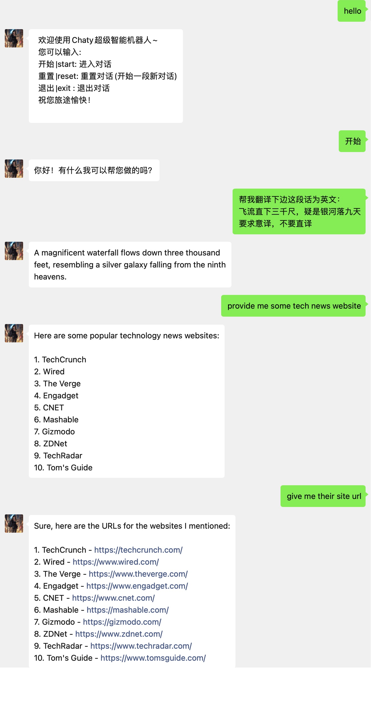

## ✨✨✨Chaty – ChatGPT ALl In One!

Read this in other languages: English | [简体中文](./README.zh-CN.md)

With Chaty, your needs about ChatGPT will come to life! Chaty allows you to:

- Use it as a command-line assistant;
- Deploy a private ChatGPT web service;
- Deploy NodeJS API for ChatGPT;
- Deploy WeChat ChatGPT bot;
- Deploy Telegram ChatGPT bot;  
- More services are under coding!

Let Chaty take you beyond expectations and into the exciting world of ChatGPT.
## Usage
Chaty is very easy to use!  
install ichaty first  
```javascript
npm i -g ichaty
```
then login with your openAI key  
```javascript
npm login <your-openAI-key>
```
```javascript
chaty // show you all commands and options  
chaty run command // run as a command chatGPT bot
chaty run web // deploy a web chatGPT service
chaty run node // deploy a node chatGPT api service
chaty run wechat // deploy a wechat chatGPT bot
chaty run telegram // deploy a telegram chatGPT bot
```

## ⚙️Installation

Chaty is a application based on Node.js, and can be installed with the following command:  
If you have not installed NodeJS, [click here](https://nodejs.org/)
```
npm i -g ichaty
```

## 🔑Login

Login with your openAI key.You can find your API key at https://platform.openai.com/account/api-keys.  
Then you can start your journey
```
chaty login <your-openAI-key>
```

## 🚀Services

Chaty provides multiple service options, and you can choose the most suitable one according to your needs.
```
-[x] command line Service📁  
-[x] private Web Service🚀  
-[x] weChat Robot Service💬   
-[x] nodeJS API Service💻 
-[] telegram Bot Service🤖  
```

### 📁command line Service   
```
chaty run command
```

### 🌍Private Web Service

Chaty can deploy a private web service, and you can access the Chaty service you created anytime by visiting http://localhost:9522.  
you can specify port with <code>chaty run web --port \<your-port\></code>  
```
chaty run web --port 9555
```



### 💬WeChat Robot Service

Chaty can also deploy a WeChat robot service, allowing you to chat with Chaty through a WeChat account.  
```
chaty run wechat
```
Scan qrcode on terminal then login your wechat!  


Just send message with hello/你好 to start your journey~


### 🤖Telegram Bot Service(under construction...)

Chaty can also deploy Telegram Bot service, enabling your users to chat with Chaty in Telegram. Simply send a message to '@your-bot' to initiate the chatbot service.

## Troubleshooting  
If your network cannot access api.openai.com, you can try run  
```
chaty proxy default
```
as a temporary proxy solution.  
For a long-term solution, it is recommended to run on a server that supports accessing api.openai.com or use a stable proxy.

## under coding

- [] support SSE
- [] support command line/ web service save dialog
- [] faster service
- [] config wechat robot params
- [] better web service ui
## Additional Features

More services are under construction!(discord, telegram, slack...)

Thank you for choosing Chaty! If you have any questions or suggestions, please feel free to contact us!