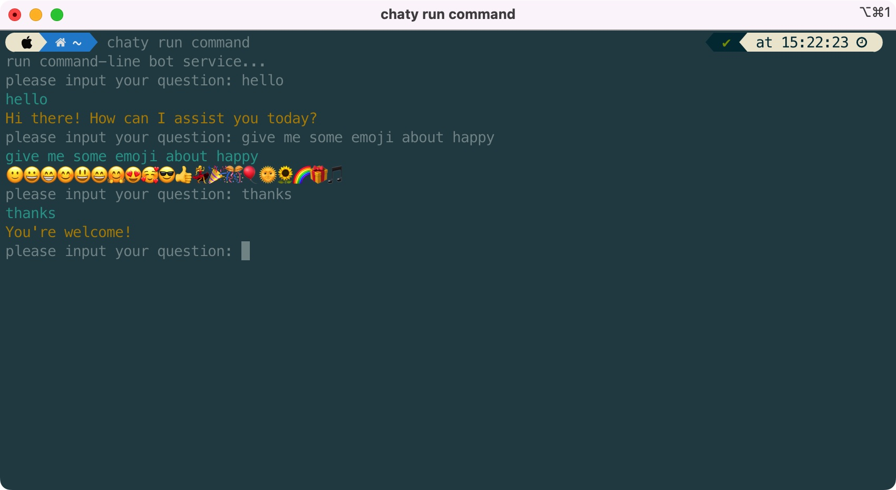

## ✨✨✨Chaty – 一站式chatGPT百宝箱

Chaty可以让您：

- 拥有一个chatGPT命令行机器人;
- 部署ChatGPT Web服务;
- 部署基于ChatGPT的NodeJS API 服务;
- 部署微信ChatGPT机器人;
- 部署Telegram ChatGPT机器人;
- 部署Discord ChatGPT机器人;
- 更多服务正在不断开发中!

让Chaty助力您探索ChatGPT的世界。

## 使用方法

Chaty的使用非常方便  
首先安装
```javascript
npm i -g ichaty
```
然后登录
```javascript
npm login <your-openAI-key>
```

```javascript
chaty // 显示所有命令和选项  
chaty run command // 运行作为命令行ChatGPT机器人
chaty run web // 部署Web ChatGPT服务
chaty run node // 部署Node ChatGPT API服务
chaty run wechat // 部署WeChat ChatGPT机器人
chaty run telegram // 部署Telegram ChatGPT机器人
```

## 安装🤖

Chaty是一个基于Node.js的应用程序，可以使用以下命令进行安装：  
如果您还没有安装NodeJS，请[点击这里](https://nodejs.org/)


```
npm i -g chaty
```
## 🔑登录

使用您的openAI密钥登录。您可以在https://platform.openai.com/account/api-keys上找到您的API密钥。  
然后，尽情遨游吧
```
chaty login <your-openAI-key>
```


## 服务

Chaty 提供多种不同的服务选项，您可根据自己需求选择合适的服务。  
```
-[x] 命令行(终端)机器人服务📁   
-[x] chatGPT Web服务🚀  
-[x] 微信机器人服务💬   
-[x] nodeJS API服务💻 
-[] telegram机器人服务🤖  
-[] discord机器人服务🤖  
```
### 📁命令行服务   
```
chaty run command
```


### 🌍私有Web服务

Chaty可以部署私人Web服务，您可以通过访问http://localhost:9522 随时访问您创建的Chaty服务。  
您可以用<code>chaty run web --port \<your-port\></code>来指定端口。
```
chaty run web --port 9555
```


### 💬微信机器人服务

Chaty还可以部署微信机器人服务，允许您通过微信账户与Chaty聊天。  
```
chaty run wechat
```
在终端上扫描二维码然后登录您的微信！  


只需发送包含hello/你好的消息即可开始您的旅程～


### 🤖Telegram机器人服务(正在开发中...)

Chaty还可以部署Telegram机器人服务，让您的用户可以在Telegram中与Chaty聊天。只需向"@your-bot"发送一条消息即可启动聊天机器人服务。

## Troubleshooting  
如果你的网络访问不了api.openai.com,可以试试运行  
```
chaty proxy default
```
作为临时代理方案运行  
长久之计还是在支持api.openai.com访问的服务器运行或者使用稳定proxy

## 正在进行中

- [] 支持SSE,结果分段展示,不用一次性等这么久
- [] 支持保存对话，继续上次对话
- [] 启动服务速度更快
- [] 支持配置微信机器人触发/退出/对话/关键词监听
- [] UI升级
# 其他功能

更多的服务正在部署中！（discord, telegram, slack...）

感谢您选择Chaty！如果您有任何问题或建议，请随时与我们联系！
